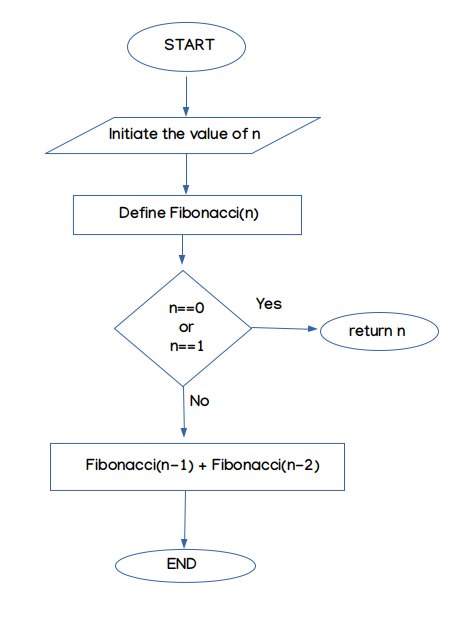
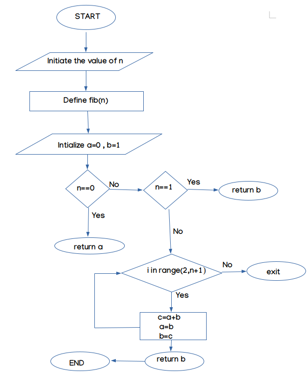
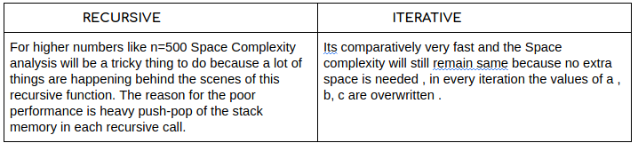
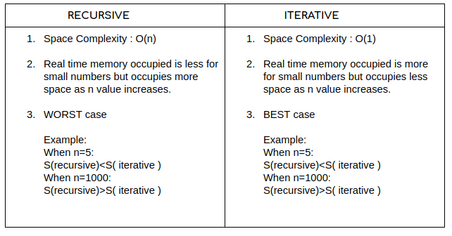

**Method-1**

---
Using Recursion :

For Fibonacci recursive implementation or any recursive algorithm, the space required is proportional to the maximum depth of the recursion tree, because, that is the maximum number of elements that can be present in the implicit function call stack.

**Algorithm(Pseudo Code):**

*   Start
*   Intiate value of n
*   Define Fibonacci(n)
*   Check if n==0 or n==1 then return n
*   else return Fibonacci(n-1)+Fibonacci(n-2)
*   End

***Space Complexity : O(n)***

~~~
import os,psutil

pid=os.getpid() #process id

ps=psutil.Process(pid)

def Fibonacci(n): 
    
    if n==0 or n==1:
      return n
    else:
      return Fibonacci(n-1)+Fibonacci(n-2) 
  
print("5th term of fibonacci series is : " ,Fibonacci(5)) 

memoryUse =ps.memory_info()

print(memoryUse)
~~~
#### Memory used :

~~~
5th term of fibonacci series is :  5
pmem(rss=111370240, vms=524972032, shared=32018432, text=3883008, lib=0, data=182702080, dirty=0)
~~~

-----------------------------

**Method-2**

---
Using Iterative Method:

For the iterative approach, the amount of space required is the same for fib(6) and fib(100), i.e. as N changes the space/memory used remains the same. Hence it’s space complexity is O(1) or constant.

**Algorithm(Pseudo Code):**

*   Start
*   Initialize a=0,b=1
*   Check if n==0 then return a
*   elseif check n==1 then return b
*   else  initialise a for loop with i in range(2,n+1) and return 

            *   c=a+b
            *   a=b
            *   b=c
*   End

***Space Complexity:O(1)***
 

~~~
import os,psutil

pid=os.getpid() 

ps=psutil.Process(pid)

def fib(n): 
    a = 0
    b = 1
    
    if n == 0: 
      return a    
    elif n == 1: 
        return b 
    else: 
        for i in range(2,n+1): 
            c = a + b 
            a = b 
            b = c 
        return b 
  
print("5th term of fibonacci series is : " ,fib(5))

memoryUse =ps.memory_info()
print(memoryUse)
~~~
#### Memory used:
~~~
5th term of fibonacci series is :  5
pmem(rss=111575040, vms=524972032, shared=32018432, text=3883008, lib=0, data=182702080, dirty=0)
~~~

# Memory Analysis 

---------------------

# Observations

--------------------------------

