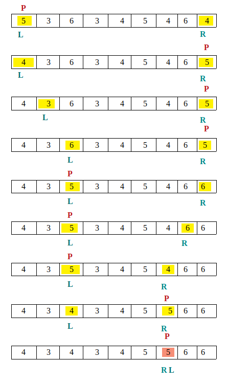

# Quick Sort

--------------

Quick sort is a highly efficient sorting algorithm and is based on partitioning of array of data into smaller arrays. A large array is partitioned into two arrays one of which holds values smaller than the specified value, say pivot, based on which the partition is made and another array holds values greater than the pivot value.

Quicksort partitions an array and then calls itself recursively twice to sort the two resulting subarrays. This algorithm is quite efficient for large-sized data sets as its **average** and **worst-case** complexity are **O(nLogn)** and **O(n2)**, respectively.

### Algorithm

- Step 1 − Choose the highest index value has pivot
- Step 2 − Take two variables to point left and right of the list excluding pivot
- Step 3 − left points to the low index
- Step 4 − right points to the high
- Step 5 − while value at left is less than pivot move right
- Step 6 − while value at right is greater than pivot move left
- Step 7 − if both step 5 and step 6 does not match swap left and right
- Step 8 − if left ≥ right, the point where they met is new pivot

~~~
def partition(array, start, end):
    pivot = array[start]
    low = start + 1
    high = end

    while True:
        
        while low <= high and array[high] >= pivot:
            high = high - 1

        # Opposite process of the one above
        while low <= high and array[low] <= pivot:
            low = low + 1

        # We either found a value for both high and low that is out of order
        # or low is higher than high, in which case we exit the loop
        if low <= high:
            array[low], array[high] = array[high], array[low]
            # The loop continues
        else:
            # We exit out of the loop
            break

    array[start], array[high] = array[high], array[start]

    return high

def quick_sort(array, start, end):
    if start >= end:
        return

    p = partition(array, start, end)
    quick_sort(array, start, p-1)
    quick_sort(array, p+1, end)

A = [2.5, 4.5, 3.0,1.2,6.5,8.9,7.4,6.3] 
B = [5,3,6,3,4,5,4,6,4]

print ("Array A is ", end ="\n\n") 
printList(A) 
print("\n\n")
print ("Sorted array A is:",end ="\n\n")
start=time.time() 
quick_sort(A, 0, len(A) - 1)
end=time.time() 
printList(A) 
print("\n\n")
print("Time taken for execution is :",end-start) 
print("\n\n")
print ("Array B is ", end ="\n\n") 
printList(B) 
print("\n\n")
print ("Sorted array B is:",end ="\n\n")
start1=time.time()
quick_sort(B, 0, len(B) - 1)
end1=time.time()
printList(B)
print("\n\n")
print("Time taken for execution is :",end1-start1)
~~~

# Merge Sort

--------------

Merge sort is a sorting technique based on divide and conquer technique. With worst-case time complexity being **Ο(n log n)**, it is one of the most respected algorithms.

Merge sort first divides the array into equal halves and then combines them in a sorted manner.

### Algorithm

Step 1 − if it is only one element in the list it is already sorted, return.
Step 2 − divide the list recursively into two halves until it can no more be divided.
Step 3 − merge the smaller lists into new list in sorted order.

~~~
def mergeSort(arr): 
    if len(arr) >1: 
        mid = len(arr)//2 # Finding the mid of the array 
        L = arr[:mid] # Dividing the array elements  
        R = arr[mid:] # into 2 halves 
  
        mergeSort(L) # Sorting the first half 
        mergeSort(R) # Sorting the second half 
  
        i = j = k = 0
          
        # Copy data to temp arrays L[] and R[] 
        while i < len(L) and j < len(R): 
            if L[i] < R[j]: 
                arr[k] = L[i] 
                i+= 1
            else: 
                arr[k] = R[j] 
                j+= 1
            k+= 1
          
        # Checking if any element was left 
        while i < len(L): 
            arr[k] = L[i] 
            i+= 1
            k+= 1
          
        while j < len(R): 
            arr[k] = R[j] 
            j+= 1
            k+= 1
  
# Code to print the list 
def printList(arr): 
    for i in range(len(arr)):         
        print(arr[i], end =" ") 
    print() 
  
# driver code to test the above code 
if __name__ == '__main__': 
    A = [2.5, 4.5, 3.0,1.2,6.5,8.9,7.4,6.3] 
    B = [5,3,6,3,4,5,4,6,4]
    print ("Array A is ", end ="\n\n")  
    printList(A) 
    start=time.time()
    mergeSort(A)
    end=time.time() 
    print("\n\n")
    print("Sorted array A is: ", end ="\n\n") 
    printList(A) 
    print("\n\n")
    print("Time taken for execution is :",end-start)
    print("\n\n")
    print ("Array B is ", end ="\n\n")  
    printList(B) 
    start1=time.time()
    mergeSort(B) 
    end1=time.time()
    print("\n\n")
    print("Sorted array B is: ", end ="\n\n") 
    printList(B) 
    print("\n\n")
    print("Time taken for execution is :",end1-start1)
~~~

## Observation
- Array B is taking more time for sorting than Array A because Array B has repeated elements .

